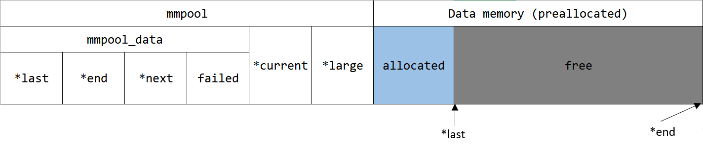
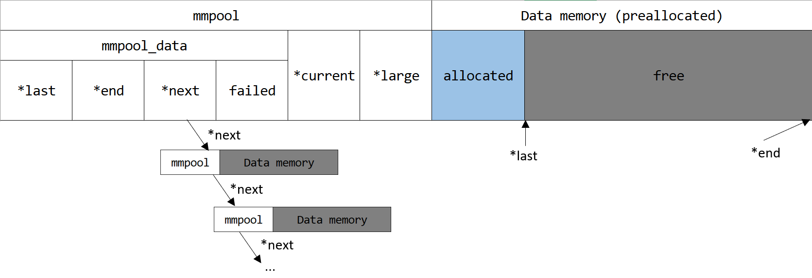
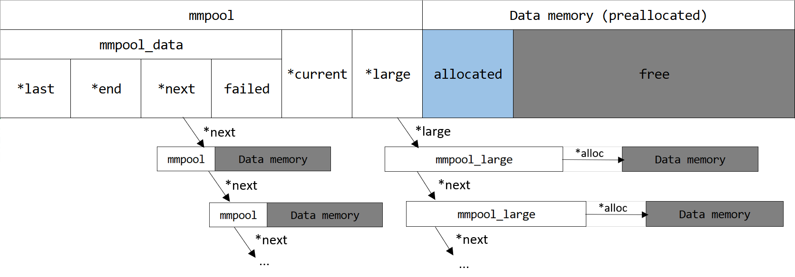
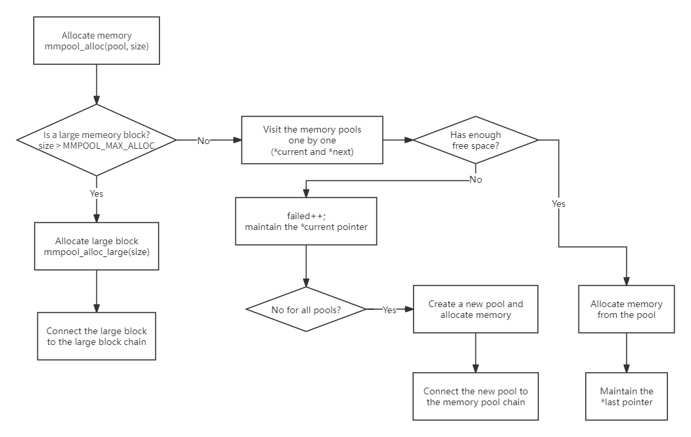

# CS205 Assignment 3 - Memory Pool

**Designer**: IceLocke

If you have any questions about this document (e.g. ambiguous details), welcome to contact me on QQ (Search my nickname "Ice" in the course group), or raise an issue on GitHub [repository](https://github.com/IceLocke/CS205-2023Fall-Assignment3-Memory-Pool).

**You ought to use `C` to implement.**

## 1 Introduction

**Memory pools** is the use of pools for memory management that allows dynamic memory allocation. Dynamic memory allocation can, and has been achieved through the use of techniques such as `malloc` and C++'s operator `new`; although established and reliable implementations, these suffer from *fragmentation* because of variable block sizes, and low efficiency due to allocating memory through system frequently.
 It is not recommendable to use them in a real-time system due to **performance**. 

> **Fragmentation**
> 
> Fragmentation is an unwanted problem in the operating system in which the processes are loaded and unloaded from memory, and free memory space is fragmented. Processes can't be assigned to memory blocks due to their small size, and the memory blocks stay unused. 

A more efficient solution is **preallocating** several memory blocks with the same size called the memory pool. The application can allocate, access, and free blocks through the memory pool, which is **specifically designed for the application**, to achieve better performance.

In this assignment, you will implement a memory pool for a web server. We will provide a background and a detailed tutorial for those who are not familiar with this topic. We're sure that you will have a better understanding of memory management through this assignment. 

I hope you enjoy it!

## 2 Background

**It's not necessary to read this part, but the information of the scenario will help you better understand the *Design* part**.

Assume that you are a new computer engineer at *Millennium Science School*.


In this school, students are free to select courses that they are interested in. However, with the increasing of students, they found that the web-based course selecting **system sometimes lags when lots of students select courses simultaneously.**

As an excellent engineer, you found that this problem is caused by the poor memory management of the web server: there exist problems of frequent **memory leaking, memory fragments**, etc. Now it's your turn to design a memory pool for the specific scenario!

> **Features of the Web Server**
> 
> For such a course-selecting system, you find the features of the web server:
> 
> 1. **High Concurrency**: The performance i.e. reducing memory leaking and memory fragments is important.
> 
> 2. **Short Life Cycle of Connections**: The server usually deals with short-term HTTP connections. This means that you don't need to maintain the memory order for a long time, since the memory pool will be destroyed after a connection is ended.
> 
> 3. **Frequent Use of Small Memory Block**

Regarding all the above, you proceed with the implementation of the memory pool.


## 3 Design of the Memory Pool

Regarding the features of the application, this is a practical strategy for the memory pool. Meanwhile, we provide a unified implementation blueprint. 

### 3.1 Allocate Memory

Since the web server will use a small memory block frequently, we may need to consider memory allocation in 2 cases. 

Consider such a strategy when the program tries to allocate a block of memory: If the `size` of the memory block is larger than the size of the maximum preallocated free space `MMPOOL_MAX_ALLOC` of a memory pool, then we directly allocate a large memory block through `malloc`. Otherwise, we allocate memory manually from the preallocated memory from the memory pool.

> **This is important, so we provide a Chinese version.**
> 
> 当程序申请的内存块大于内存池的最大预分配空间 `MMPOOL_MAX_ALLOC` 时，我们直接使用 `malloc` 申请大块的内存。否则，我们从内存池的预分配空间中手动分配内存。

### 3.2 Free Memory

Let's recall features of the web server: connections have short life cycles and need high performance. So, it might be (actually it is) a good idea to **support only the free of large memory blocks** for a memory pool of a web server.

### 3.3 Implementation Details

We will use three structures and several functions to implement the memory pool.

#### 3.3.1 Structure Definition

- `mmpool` : the structure to manage a memory pool

- `mmpool_data` : the structure to maintain the information of data memory

- `mmpool_large`: the structure to maintain the information of a large memory block

The definition of them is as follows:

```c
typedef struct mmpool mmpool_t;
typedef struct mmpool_data mmpool_data_t;
typedef struct mmpool_large mmpool_large_t;

#define MMPOOL_MAX_FAILED 4
struct mmpool_data {
    uint8_t        *last;   
    // The start address of the free space
    uint8_t        *end;    
    // The end address of the mmpool entry
    mmpool_t       *next;   
    // Points to the next memory pool on the memory pool chain
    size_t         failed;  
    // Counter of failed allocation
};
```

```c
struct mmpool_large {
    mmpool_large_t    *next; 
    // Points to the next large memory 
    void              *alloc; 
    // Points to the data memory
};
```

```c
#define MMPOOL_MAX_ALLOC (0x1000 - sizeof(mmpool_t))
#define MMPOOL_SIZE      (0x1000 - sizeof(mmpool_t))
struct mmpool {
    mmpool_data_t   data;    
    // Information of data memory of this pool
    mmpool_t        *current; 
    // Points to the nearest pool s.t. failed <= MMPOOL_MAX_FAILED
    mmpool_large_t  *large;   
    // The start of the chain of large memory block 
};
```

#### 3.3.2 Memory Layout

Let's first look at `mmpool`. The memory layout of `mmpool` contains two parts: itself and a block of preallocated memory (its size is determined by `MMPOOL_SIZE`).



##### `*last` and `*end`

`mmpool_data` contains two pointers `*last` and `*end`, **they point to the start address of free memory and the end address of the data memory, respectively**. Hence, once we allocate memory from the memory pool, the `*last` pointer should move afterward at that size.

##### `*next`

Data memory has a fixed size, and it cannot be expanded like `vector` in C++. So, **when the free memory in the data memory is run off, we should create a new "sub" memory pool**. 

To only use one memory pool for memory allocation, we use `*next` to point to the new memory pool and maintain a chain of memory pools. Notice that the latest allocated `mmpool` entry on the chain is **the last one**.

Later, if we want to allocate a block of memory, **we will visit every memory pool in the chain by `*next`, and find the pool with enough free space**. If there doesn't exist one, create a new memory pool.



##### `failed`

This variable is used to record how many times memory allocation is failed i.e. the free memory is not enough. 

What's the meaning? Recall that we should have visited every memory pool, but it's time-consuming. Therefore, by recording `failed`, we can just skip the pools that have less or even no free space. This can be done by another pointer, `*current`.

##### `*current`

`current` will point to the nearest pool s.t. `failed <= MMPOOL_MAX_FAILED`. It means that when we are visiting the memory pool on the chain, if `failed > MMPOOL_MAX_FAILED`, then let `current = pool->data.next`.

##### `*large`

This pointer points to the first large memory block (allocation size > `MMPOOL_MAX_ALLOC`) of the memory pool.

```c
struct mmpool_large {
    mmpool_large_t    *next; 
    void              *alloc; 
};
```

Like `*next` of `mmpool`, `mmpool_large` will also form a chain. Notice that the latest allocated `mmpool_large` entry is **the last one** on the chain.



> **You may have a question:** Why should we isolate `mmpool_data` from `*current` and `*large` in `mmpool`?
> 
> In fact, for `mmpool` entries those are created when all the previous `mmpool` entries don't have enough space, we should have moved `*last` backward `2*sizeof(void*)` bytes to save the memory that `*large` and `*current` accounts (even if they only take 16 bytes in 64-bit machine), since `*current` and `*large` are **totally useless** for these newly created `mmpool` entries.
>
> Therefore, isolation makes the structure more logical and ingenious.
>
> **But to SIMPLIFY this assignment, we WOULD NOT do this. :)**
>
> If you want to test this optimization, please contact me. I will upload a new problem (it doesn't accounts for the score of the whole assignment) on OJ, once anybody asks for it.

#### 3.3.3 Functions to Implement

We have implement `mmpool_create` for you.

```c
/**
 * @brief Create a mmpool_t entry.
 * 
 * @return mmpool_t* the pointer of the memory pool.
 */
mmpool_t* mmpool_create();
```

```c
/**
 * @brief Allocate a memory block from a memory pool.
 * 
 * @param pool the pointer of the memory pool.
 * @param size size of the memory block (in bytes).
 * 
 * @return void* pointer of the start address of the memory block.
 */
void* mmpool_alloc(mmpool_t *pool, size_t size);
```

```c
/**
 * @brief Allocate a large memory block by `malloc()`.
 * This function must be called by `mmpool_alloc()`. Do not manually call it.
 * 
 * @param size size of the memory block (in bytes).
 * 
 * @return mmpool_large_t* pointer of the start address of the memory block.
 */
mmpool_large_t* mmpool_alloc_large(size_t size);
```

```c
/**
 * @brief Free a large memory block from a memory pool.
 * 
 * @param pool the pointer of the memory pool.
 * @param p `*alloc` of the large memory block.
 */
void mmpool_free_large(mmpool_t *pool, void *p);
```

```c
/**
 * @brief Destroy a memory pool.Free all related memory.
 * 
 * @param pool the pointer of the memory pool.
 */
void mmpool_destroy(mmpool_t *pool);
```

```c
/**
 * @brief Reset a memory pool i.e. 
 * reset `*current` to the pool itself, `*last` and `failed`;
 * free all large memory blocks.
 * 
 * @param pool the pointer of the memory pool
 */
void mmpool_reset(mmpool_t *pool);
```

#### 3.3.4 Allocation Procedure

Up to now, maybe you have the concept of how this memory pool works. Let's summarize it.

 

1. When the program calls `mmpool_alloc(pool, size)`, we firstly check whether it's a large memory block
   
   - If so, Allocate a large memory block by `mmpool_alloc_large(size)`, then connect the large memory block to the large memory block chain.
   
   - If not, visit the memory pools from `*current`, one by one.

2. If one memory pool has enough free space, then allocate the memory from that pool, meanwhile maintaining the `*last` pointer.

3. If the memory pool doesn't have enough free space, let `failed++`, and maintain the `current` pointer.

4. If all of the memory pools don't have enough free space, create a new one, then allocate memory from the new pool. Finally, connect it to the memory pool chain.

## 4 Task

For this assignment, your task is to design 3 structures and implement several functions to develop a memory pool that compiles the features of the application:

- `struct mmpool`: the class stands for a memory pool

- `struct mmpool_data`: the structure to maintain the information (i.e. pointers related to memory blocks, and times of failed memory allocation)

- `struct mmpool_large`: the structure to maintain the information of a large memory block

You **only need to implement the functions** in the code template. Please don't modify any other code patterns, and any other modification will lead to a **0** score.

Notice that in real systems we usually use **memory alignment** to achieve better performance, but it will make it more difficult to implement. Therefore, for this assignment, we ignore the implementation of aligned memory allocation.

## 5 Code Template

To shorten the document length, this template contains no comments. For detailed comments, please refer to the source code on Blackboard or GitHub. **Make sure that you have read the *Design of the Memory Pool* part and the comments before implementing.** If you don't know the meaning of a constant like `MMPOOL_MAX_FAILED`, you can search the macro in this document.

You are encouraged to clone the repository (https://github.com/IceLocke/CS205-2023Fall-Assignment3-Memory-Pool) from GitHub and use cmake to develop.

```c
#include <stdio.h>
#include <stdint.h>
#include <stdlib.h>

typedef struct mmpool mmpool_t;
typedef struct mmpool_data mmpool_data_t;
typedef struct mmpool_large mmpool_large_t;

#define MMPOOL_MAX_FAILED 4
struct mmpool_data {
    uint8_t        *last;
    uint8_t        *end;
    mmpool_t       *next;
    size_t         failed;
};

struct mmpool_large {
    mmpool_large_t    *next;
    void              *alloc;
};

#define MMPOOL_MAX_ALLOC (0x1000 - sizeof(mmpool_t))
#define MMPOOL_SIZE      (0x1000 - sizeof(mmpool_t))
struct mmpool {
    mmpool_data_t   data;
    mmpool_t        *current;
    mmpool_large_t  *large;
};

mmpool_t* mmpool_create();
void* mmpool_alloc(mmpool_t *pool, size_t size);
mmpool_large_t* mmpool_alloc_large(size_t size);
void mmpool_free_large(mmpool_t *pool, void *p);
void mmpool_destroy(mmpool_t *pool);
void mmpool_reset(mmpool_t *pool);

/* Functions for tests */
/* ==BEGIN== */
void prt_mmpool_details(mmpool_t *pool) {
    if (pool == NULL) return;
    puts("===MEMORY POOL DETAILS===");
    printf("POOL ADDRESS: %p\n", pool);
    printf("POOL SIZE (FOR EACH): %ul\n", MMPOOL_SIZE);
    printf("MAX ALLOCATION SIZE: %ul\n", MMPOOL_MAX_ALLOC);
    printf("MAX FAILED TIMES: %d\n", MMPOOL_MAX_FAILED);
    printf("CURRENT ACTIVE POOL ADDRESS: %p\n", pool->current);
    puts("\nSUB POOL DETAILS:");

    size_t count = 0;
    mmpool_t *cur = pool;
    while (cur != NULL) {
        printf("\t-> Sub pool #%lu, address=%p, free_space=%lu (bytes), failed=%lu\n",
                ++count, cur, (size_t)(cur->data.end - cur->data.last), cur->data.failed);
        cur = cur->data.next;
    }
    printf("SUB POOL COUNT: %lu\n", count);

    puts("\nLARGE BLOCK DETAILS: ");
    count = 0;
    mmpool_large_t *large = pool->large;
    while (large != NULL) {
        printf("\t-> Large block #%lu, address=%p\n", ++count, large);
        large = large->next;
    }
    printf("LARGE BLOCK COUNT: %lu\n", count);
    puts("===MEMORY POOL DETAILS END===\n");
}
/* ==END== */

mmpool_t* mmpool_create() {
    mmpool_t* p = NULL;

    p = (mmpool_t*) malloc(sizeof(mmpool_t) + MMPOOL_SIZE);
    if (p != NULL) {
        p->data.last = (uint8_t*) p + sizeof(mmpool_t);
        p->data.end = p->data.last + MMPOOL_SIZE;
        p->data.next = NULL;
        p->data.failed = 0;

        p->current = p;
        p->large = NULL;
    }

    return p;
}

/* WRITE YOUR CODE HERE */
/* YOU ONLY NEED TO SUBMIT THIS PART */
/* ==BEGIN== */
void* mmpool_alloc(mmpool_t *pool, size_t size) { }

mmpool_large_t* mmpool_alloc_large(size_t size) { }

void mmpool_free_large(mmpool_t *pool, void *p) { }

void mmpool_destroy(mmpool_t *pool) { }

void mmpool_reset(mmpool_t *pool) { }
/* ==END== */

#define MAX_POINTERS 100000

int main() {
    int Q, q, op;
    size_t size;

    mmpool_t *pool;
    void *small[MAX_POINTERS], *big[MAX_POINTERS];
    size_t scnt = 0, bcnt = 0;

    scanf("%d", &Q);
    for (q = 0; q < Q; ++q) {
        scanf("%d", &op);
        printf("[DEBUG] Query: %d, Operator: %d\n", q, op);

        if (op == 1)
            pool = mmpool_create();
        else if (op == 2) {
            scanf("%lu", &size);
            if (size <= MMPOOL_MAX_ALLOC)
                small[scnt++] = mmpool_alloc(pool, size);
            else big[bcnt++] = mmpool_alloc(pool, size);
        }
        else if (op == 3)
            mmpool_free_large(pool, big[--bcnt]);
        else if (op == 4)
            mmpool_reset(pool);
        else if (op == 5) {
            mmpool_destroy(pool);
            pool = NULL;
        }
        else puts("UNKNOWN OPERATOR!");

        prt_mmpool_details(pool);
    } 

    return 0;
}
```

## 6 Input & Output

We provide a `main()` function for you. You don't need to worry about this.

**We promise that in each test case, `mmpool_create` and `mmpool_destroy` will be called in pairs, i.e. the test case won't cause a memory leak on purpose.**

### Sample Input & Output

There is a couple of sample input and output files of the given `main()` function uploaded on Blackboard and GitHub. Make sure that your output **(except the address)** is the same as the file we have given before submitting your source code to OJ.

| Filename   | Description                                         |
| ---------- | --------------------------------------------------- |
| mmpool.in  | Sample input file                                   |
| mmpool.out | Sample output file, actually is the memory pool log |

## 7 Judgement

On the online judge, the `main()` function is quite different from the template we gave. We will put your implementation in some computational tasks and check all but not limit to the following aspects:

- Maintenance of the memory pool structure

- Correctness of memory order (check by the correctness of computation)

- Memory management (memory leak, etc.)
